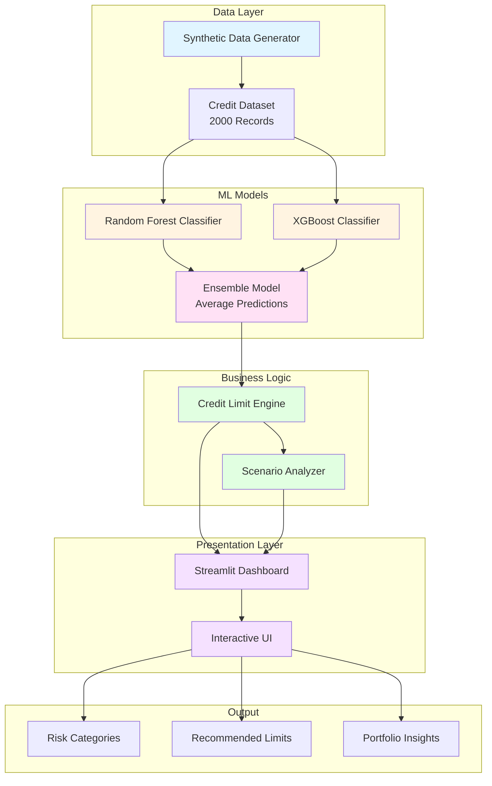

# 💳 Credit Limit Assignment System

> **AI-Powered Credit Decision Platform for Indian Financial Institutions**

A comprehensive machine learning-based credit limit assignment system that uses Random Forest and XGBoost algorithms to predict default probability and recommend optimal credit limits for customers based on their CIBIL scores, repayment history, and financial profile.

[](https://www.python.org/downloads/)
[](https://streamlit.io/)
[](https://opensource.org/licenses/MIT)

---

## 🎯 Overview

This system helps banks and financial institutions in India make data-driven credit limit decisions by:

- **Predicting default probability** using ensemble ML models (Random Forest + XGBoost)
- **Calculating risk-adjusted credit limits** based on CIBIL scores and payment history
- **Analyzing economic scenarios** (Normal/Slowdown/High Growth) for strategic planning
- **Providing interactive dashboards** for portfolio management and decision-making

**Market**: Indian (INR currency, CIBIL 300-900 scoring system)

---

## 🏗️ Architecture



---

## 🚀 Quick Start

### Prerequisites

- Python 3.8 or higher
- pip package manager

### Installation

1. **Clone the repository**
   ```bash
   git clone https://github.com/Luqmaan29/Credit_Limit_Assignment.git
   cd Credit_Limit_Assignment
   ```

2. **Install dependencies**
   ```bash
   pip install -r requirements.txt
   ```

3. **Generate data and train models**
   ```bash
   python data_generator.py
   python model_training.py
   ```

4. **Launch the dashboard**
   ```bash
   streamlit run app.py
   ```

The dashboard will open at `http://localhost:8501`

---

## 📁 Project Structure

```
Credit_Limit_Assignment/
│
├── app.py                          # Streamlit dashboard application
├── data_generator.py               # Synthetic Indian market data generator
├── model_training.py               # ML model training (RF + XGBoost)
├── credit_limit_engine.py          # Credit limit calculation engine
├── scenario_analysis.py            # Economic scenario analysis
├── setup.py                        # Automated setup script
├── requirements.txt                # Python dependencies
├── run.sh / run.bat               # Quick start scripts
│
├── data/                           # Generated datasets
│   └── credit_data.csv            # 2000 customer records
│
├── models/                         # Trained ML models
│   ├── rf_model.pkl               # Random Forest model
│   ├── xgb_model.pkl              # XGBoost model
│   ├── feature_columns.pkl        # Feature names
│   └── feature_importance.csv     # Feature rankings
│
└── README.md                       # This file
```

---

## 🔑 Key Features

### 1. **Personal Credit Calculator**
Interactive form for users to input their financial details and receive instant credit limit recommendations with risk assessment.

### 2. **Portfolio Overview**
Comprehensive dashboard showing:
- Total customers and exposure
- CIBIL score distribution
- Credit utilization patterns
- Risk categorization
- Economic scenario breakdown

### 3. **Credit Recommendations**
Bulk analysis of all customers with:
- Current vs recommended limits
- Increase/decrease suggestions
- Risk-based filtering
- Change percentage analysis

### 4. **Risk Analysis**
Advanced analytics including:
- Default probability heatmaps
- Portfolio exposure metrics
- Feature importance rankings
- High-risk customer identification

### 5. **Scenario Planning**
Economic condition analysis:
- **Normal**: Moderate growth strategy
- **Slowdown**: Conservative lending approach
- **High Growth**: Aggressive expansion phase

### 6. **Customer Details**
Individual customer search and drill-down with detailed risk profiles and recommendation reasoning.

---

## 🧪 Machine Learning Models

### Algorithms

- **Random Forest Classifier**: 100 trees, max depth 10, handles non-linear relationships
- **XGBoost Classifier**: 100 estimators, learning rate 0.1, gradient boosting for accuracy
- **Ensemble Method**: Average of both model predictions for best performance

### Model Performance

- **Training Size**: 2,000 customers, 17 features
- **Train-Test Split**: 80/20
- **ROC-AUC Score**: ~0.85 (ensemble)
- **Feature Engineering**: Automatic from 19 raw attributes

### Key Features Used

1. CIBIL Score (300-900)
2. Monthly Income (₹)
3. Credit Utilization (%)
4. Payment History Score
5. On-Time Payment Rate
6. Debt-to-Income Ratio
7. Account Age
8. Transaction Patterns
9. Behavior Score

---

## 📊 Credit Limit Formula

```python
Base Limit = Monthly Income × 2.5 × CIBIL_Multiplier

Recommended Limit = Base Limit × Risk_Multiplier × Adjustments

Where:
- CIBIL_Multiplier: Based on score bands (750+ = 1.5x, 700+ = 1.3x, etc.)
- Risk_Multiplier: 1 - (Default_Probability × 0.6)
- Adjustments: Payment history + Behavior score + Utilization bonus
```

### Risk Categories

| Category | Default Probability | Action |
|----------|---------------------|--------|
| 🟢 **Low Risk** | 0-10% | Increase limits generously |
| 🟡 **Medium Risk** | 10-25% | Maintain or slightly increase |
| 🟠 **High Risk** | 25-40% | Reduce significantly |
| 🔴 **Very High Risk** | 40%+ | Reduce to minimum or freeze |

---

## 💻 Technology Stack

- **Backend**: Python 3.8+
- **Machine Learning**: Scikit-learn, XGBoost
- **Data Processing**: Pandas, NumPy
- **Visualization**: Streamlit, Plotly
- **Model Serialization**: Pickle

---

## 📈 Usage Example

### Calculate Credit Limit

```python
from credit_limit_engine import CreditLimitEngine

engine = CreditLimitEngine()

# Customer profile
customer = {
    'monthly_income': 50000,      # ₹
    'cibil_score': 750,
    'default_prob': 0.12,
    'utilization': 0.3,
    'on_time_rate': 0.95,
    'behavior_score': 0.85
}

# Calculate recommended limit
recommended = engine.calculate_recommended_limit(customer)
print(f"Recommended Limit: ₹{recommended:,.0f}")
```

### Scenario Analysis

```python
from scenario_analysis import ScenarioAnalyzer

analyzer = ScenarioAnalyzer()

# Analyze different economic scenarios
scenarios = analyzer.analyze_scenarios(customer_data)
print(scenarios)
```

---

## 🎨 Dashboard Screenshots

### Personal Credit Calculator
Interactive input form with real-time recommendations based on user's financial profile.

### Portfolio Analytics
Comprehensive visualizations showing credit score distributions, utilization patterns, and risk heatmaps.

### Scenario Planning
Economic impact analysis comparing Normal, Slowdown, and High Growth scenarios.

---

## 🔧 Customization

### Adjust Credit Limit Multipliers

Edit `credit_limit_engine.py`:
```python
self.base_multiplier = 2.5  # Change income multiplier
```

### Modify Model Parameters

Edit `model_training.py`:
```python
RandomForestClassifier(n_estimators=200)  # Add more trees
```

### Add New Features

Edit `data_generator.py` to include additional attributes or modify distributions.

---

## 📋 Requirements

```
streamlit>=1.28.0
pandas>=2.2.0
numpy>=1.26.0
scikit-learn>=1.3.0
xgboost>=2.0.0
plotly>=5.18.0
matplotlib>=3.8.0
seaborn>=0.13.0
openpyxl>=3.1.0
```

---

## 🤝 Contributing

Contributions are welcome! Please feel free to submit a Pull Request.

1. Fork the repository
2. Create your feature branch (`git checkout -b feature/AmazingFeature`)
3. Commit your changes (`git commit -m 'Add some AmazingFeature'`)
4. Push to the branch (`git push origin feature/AmazingFeature`)
5. Open a Pull Request

---

## 📝 License

This project is licensed under the MIT License - see the [LICENSE](LICENSE) file for details.

---

## 👤 Author

**Luqmaan**

- GitHub: [@Luqmaan29](https://github.com/Luqmaan29)
- Project: [Credit Limit Assignment](https://github.com/Luqmaan29/Credit_Limit_Assignment)

---

## 🙏 Acknowledgments

- Synthetic data generation for Indian credit market
- Machine learning best practices for credit risk assessment
- Streamlit community for excellent UI framework

---

## 📞 Support

For questions, issues, or feature requests, please open an issue on GitHub.

---

**Built with ❤️ for Indian Financial Institutions** 🇮🇳
